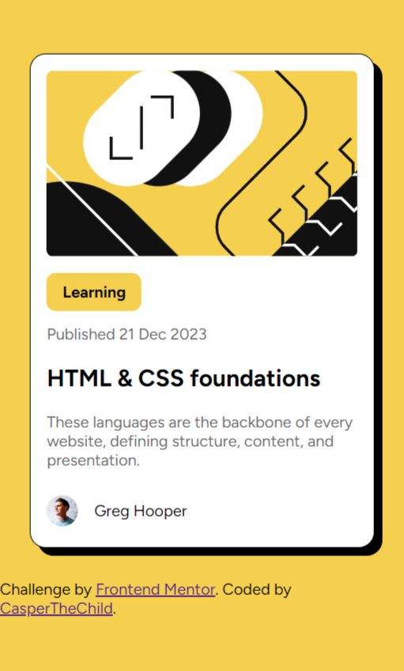

# Frontend Mentor - Blog preview card solution

This is a solution to the [Blog preview card challenge on Frontend Mentor](https://www.frontendmentor.io/challenges/blog-preview-card-ckPaj01IcS). Frontend Mentor challenges help you improve your coding skills by building realistic projects. 

## Table of contents

- [Overview](#overview)
  - [The challenge](#the-challenge)
  - [Screenshot](#screenshot)
  - [Links](#links)
- [My process](#my-process)
  - [Built with](#built-with)
  - [What I learned](#what-i-learned)
  - [Continued development](#continued-development)
  - [Useful resources](#useful-resources)
- [Author](#author)
- [Acknowledgments](#acknowledgments)

**Note: Delete this note and update the table of contents based on what sections you keep.**

## Overview

### The challenge

Users should be able to:

- See hover and focus states for all interactive elements on the page

### Screenshot




### Links

- Solution URL: [Add solution URL here](https://your-solution-url.com)
- Live Site URL: [Add live site URL here](https://your-live-site-url.com)

## My process

### Built with

- Semantic HTML5 markup
- CSS custom properties
- Transition
- Flexbox
- [Styled Components](https://fonts.google.com/specimen/Figtree?query=figtree) - For styles

### What I learned

I've learned how to use transitions, and became a bit more confident with css and html.

```html
<h1>Used variables for the first time</h1>
```
```css
:root {
  --Yellow-123: hsl(47, 88%, 63%);
  --White: hsl(0, 0%, 100%);
  --Gray-500: hsl(0, 0%, 42%);
  --Gray-950: hsl(0, 0%, 7%);
}
```

### Continued development

I am not sure did I use em and rem properties good enough in describing font-sizes and shapes. I would like to practise on it further. 

## Author

- Frontend Mentor - [@CasperTheChild](https://www.frontendmentor.io/profile/CasperTheChild)

## Acknowledgments

I want to thank people, who might not know me. Carlos Torres who also solve problems in FrontendMentor inspired and helped me in understanding Frontend. Also, Steven Stroud and Mikdra1, who gave feedback to this person played a significant role in my development.